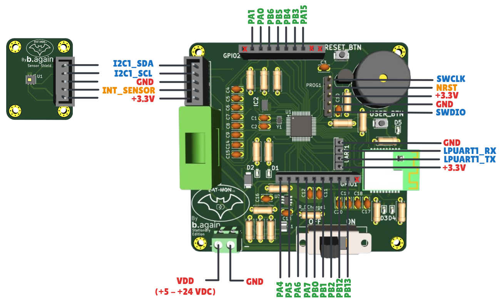
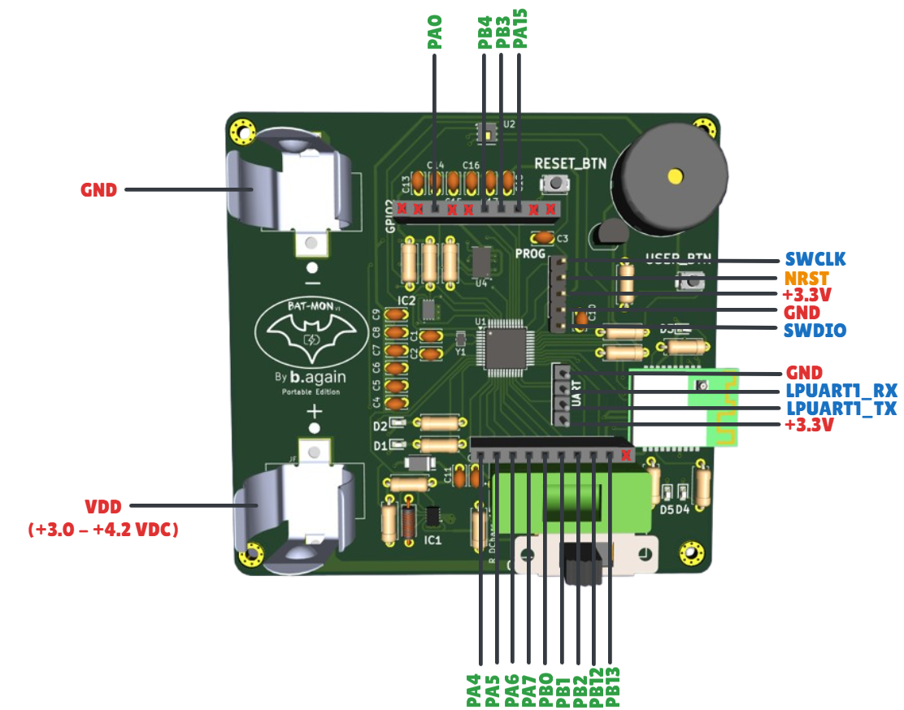

# Bat-mon-v1
**Edge Device for Battery Environment Monitoring System (Lithium Storage and Transport)**

- **Bat-Mon** is a hardware/firmware project developed as part of my Master's thesis in an industrial environment at [b.again](https://b.again.pt/pt_PT/) [(dstgroup)](https://www.dstsgps.com/intro-pt-pt/#/#intro), focused on the real-time monitoring of lithium battery systems. 
- It includes custom-designed PCBs for fixed and portable use cases, enabling the detection of environmental conditions such as **temperature**, **humidity**, and **vibration**. All hardware was developed using **KiCAD**.
- This project was developed in the context of a national R&D consortium for advanced energy storage systems:  
[New Generation Storage](https://newgenstorage.pt). It is partially funded by the **PRR – Recovery and Resilience Plan** and aims to support innovation in battery safety and smart monitoring systems.

## 🔧 Project Overview

Lithium batteries, whether in stationary storage systems or during transport, require careful environmental monitoring to ensure safety, longevity, and performance. Bat-Mon addresses this need by providing two types of monitoring devices:

- **Fixed Unit**: Designed for static storage systems. Measures temperature and humidity.
- **Portable Unit**: Designed for battery transport scenarios. Measures temperature, humidity, and vibration (via accelerometer).

Both units support low-power operation and are intended to be integrated into broader telemetry or battery management systems.

## 🧩 3D Views of the PCBs

  

    <strong>📦 Stationary Monitoring Prototype</strong> 
    
  

  

    <strong>🚚 Portable Monitoring Prototype</strong> 
    
  

## 🚀 Key Features

- 🌡️ **Temperature and Humidity Sensing**
- 📈 **Vibration Detection** (portable unit)
- 📶 **BLE Communication Support**
- 🔋 **Low Power Design**
- 📐 **Designed in KiCAD**
